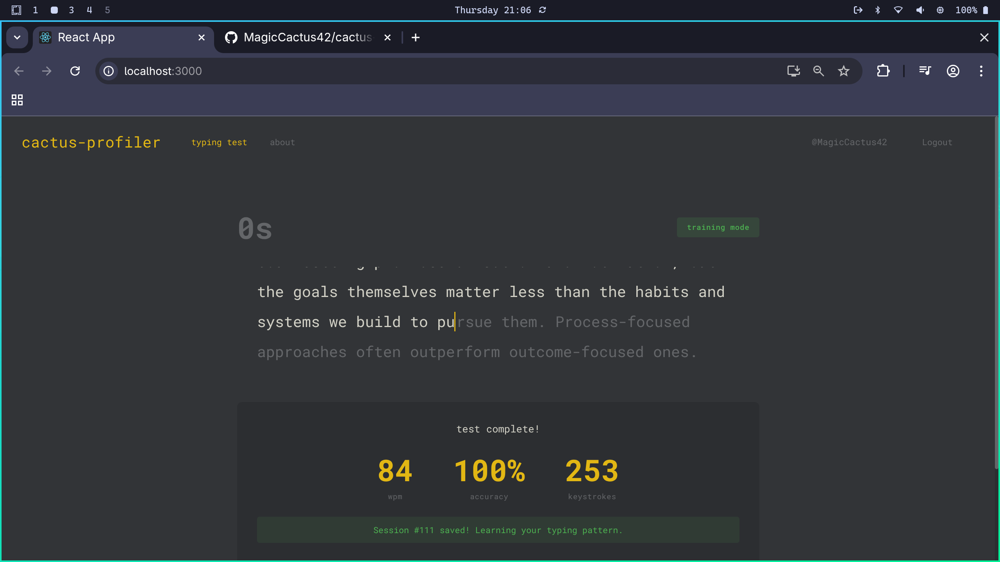
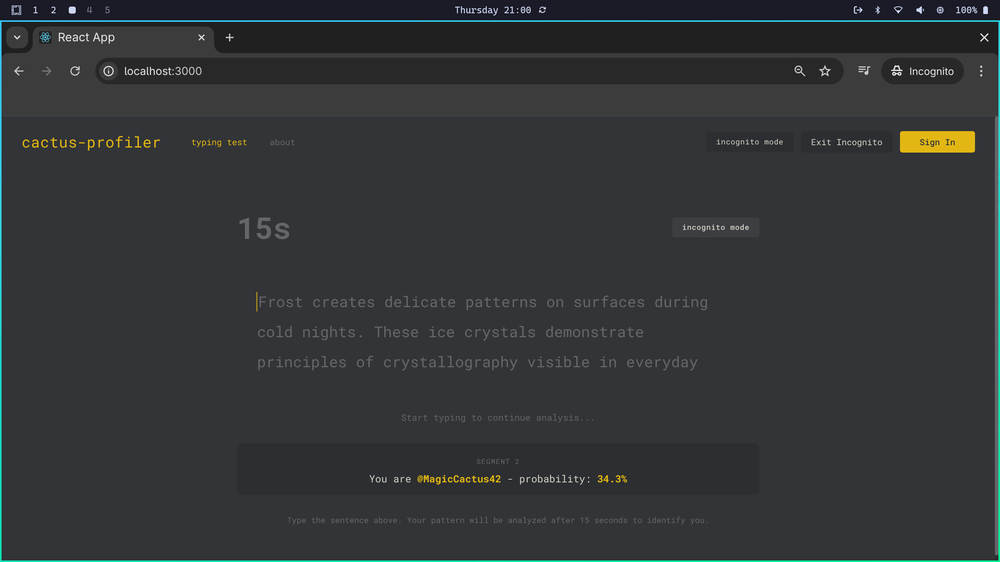
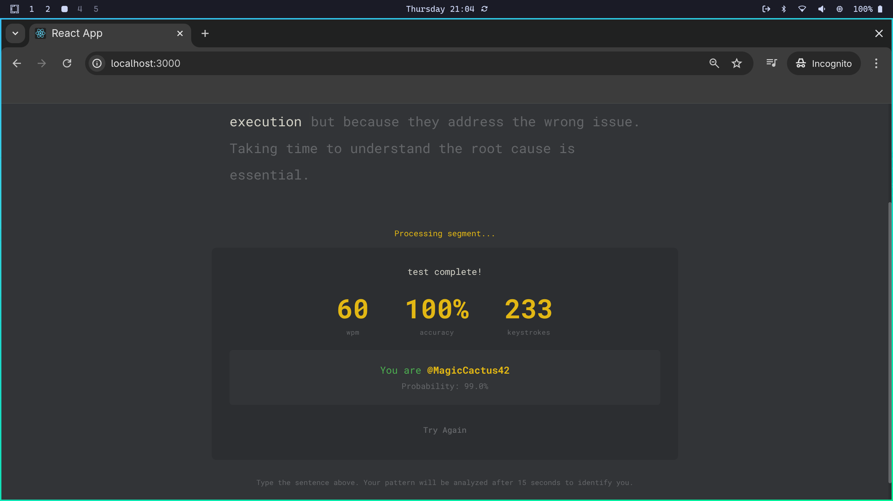

# Cactus-Profiler 🌵

**Cactus-Profiler** is a keystroke biometrics application that identifies users based on their unique typing patterns. Every person has a distinctive way of typing - the rhythm, speed, and timing between keystrokes create a "typing fingerprint" that can be used to identify them.

## 🚀 Demo

Check out the frontend only demo version:
[Link to Live Demo](https://cactus-profiler-frontend.vercel.app/)

## 📸 Screenshots

*Training Mode*

*Incognito Mode*

*Verdict*

---

## 🔍 How It Works

The system captures various typing metrics including:

* **⏱️ Dwell time** - how long each key is held down.
* **✈️ Flight time** - the time between releasing one key and pressing the next.
* **⚡ Typing speed** - words per minute and characters per second.
* **🎵 Rhythm patterns** - the consistency and variation in typing cadence.

These features are processed by a **soft-voting ensemble** (two LightGBM configurations plus an SDCA maximum-entropy model) whose probabilities are **temperature-calibrated** on held-out validation data. Model quality is measured with **group-aware validation** so augmented windows from one session never leak across the train/validation split, keeping the reported accuracy honest.

Across multiple typing samples, evidence is combined with **Bayesian sequential fusion** (accumulating per-sample log-likelihoods), so confidence grows as consistent evidence arrives rather than relying on hand-tuned score boosts.

The engine is also **open-set**: a centroid-based novelty detector measures how far a sample sits from every enrolled user's typing profile. Someone who isn't in the system is reported as **Unknown** instead of being forced onto the nearest enrolled user — a failure mode every closed-set classifier has.

## 🕵️‍♂️ Progressive Identification

The incognito mode uses a progressive elimination algorithm. As you type more sentences, the system gradually eliminates unlikely users:

* **Samples 3-9:** Users below **5%** probability are eliminated.
* **Samples 10-14:** Threshold increases to **10%**.
* **Samples 15-19:** Threshold increases to **15%**.
* And so on until a user is "confidently" identified.

## 🛠 Technology Stack

| Component | Technology |
| :--- | :--- |
| **Frontend** ⚛️ | React + TypeScript |
| **Backend** ⚙️ | .NET 10 / ASP.NET Core |
| **ML Framework** 🧠 | ML.NET — soft-voting ensemble (LightGBM + SDCA) with temperature calibration |
| **Database** 🗄️ | PostgreSQL |

## 🔒 Privacy

Your typing data is only used to train and improve the identification model. The application **does not capture the actual content** you type, only the timing metrics between keystrokes.

## 📄 License

This project is licensed under the **GNU General Public License v3.0**. See the [LICENSE](LICENSE) file for details.
